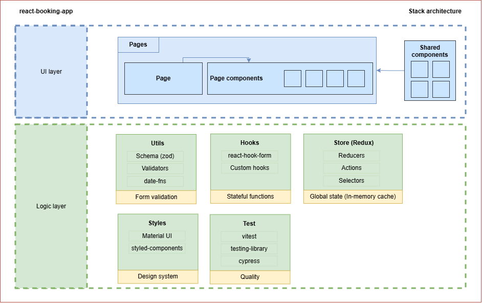

# React Booking App

> **Note**: The bookings store is pre‑populated with **5 mocked records**. Global state lives only **in memory** (Redux). Refreshing the page resets the data back to the seeded state.

## Architecture Overview



# How to Run & Test

## How to Run

### Development
```bash
npm run dev
# opens at http://localhost:5173
```

### Production Build
```bash
npm run build
npm run preview
# preview at http://localhost:4173
```

### Lint
```bash
npm run lint
```

---

## Tests

### Unit / Component (Vitest + Testing Library)

**Run once:**
```bash
npm run test
```

**Watch mode:**
```bash
npm run test:watch
```

**Coverage:**
```bash
npm run coverage
```

---

### E2E (Cypress)

**Open runner** (starts Vite and opens Cypress):
```bash
npm run cy:e2e:open
```

**Headless:**
```bash
npm run cy:e2e:run
```

**E2E scope:**
- `cypress/e2e/smoke.cy.ts` — page load & primary CTAs
- `cypress/e2e/filters.cy.ts` — property & date filters (incl. clear)
- `cypress/e2e/availability.cy.ts` — availability modal, enabled/disabled by property
- `cypress/e2e/crud.cy.ts` — create, edit, validations, delete booking
- `cypress/e2e/list.cy.ts` — list rendering, empty state, basic interactions

---

## Conventions & Patterns

- **Shared UI components**
  - Location: `src/components/<ComponentName>/`
  - Files:
    - `index.tsx` — React component
    - `styles.ts` — styled‑components styles
    - `index.test.tsx` — unit / component tests

- **Page‑specific components**
  - Location: `src/pages/<PageName>/<ComponentName>/`
  - Files:
    - `index.tsx` — component tied to the page’s domain
    - `styles.ts` — styled‑components styles
    - `index.test.tsx` — unit / component tests

- **Pages (routes)**
  - Location: `src/pages/<PageName>/index.tsx` (+ `styles.ts`)
  - Page‑scoped subcomponents live under the same folder.

- **Hooks**
  - Location: `src/hooks/<useYourNewHook>.ts`

- **Redux store (per domain)**
  - Location: `src/store/<domain>/`
  - Files:
    - `slice.ts` — reducers/actions
    - `selectors.ts` — memoized selectors
    - `types.ts` — TS types

- **Utilities**
  - Location: `src/utils/` (e.g., `date.ts`, validators, schema)

- **Styles / Theme**
  - Location: `src/styles/` (e.g., `theme.ts`, global styles)
  - Design system: **MUI** + styled‑components — see **Material UI components**: https://mui.com/material-ui/all-components/
  - Breakpoints available in `src/styles/theme.ts`:
    - `xs: 420`, `sm: 600`, `md: 900`, `lg: 1200`, `xl: 1536`

- **E2E tests (Cypress)**
  - Location: `cypress/e2e/<domain>/yourtest.cy.ts`
  - Examples: `filters.cy.ts`, `crud.cy.ts`, `availability.cy.ts`, `smoke.cy.ts`

---

## Features

### Bookings Page

**Filter Header**
- Filter by **property**
- Filter by **date range**

**Bookings List**
- Cards with **dates**, **guest**, **property**
- **Edit** (prefilled modal)
- **Delete**

**Right-side Actions**
- **Availability** (see property availability and open create pre-filled)

### Create / Edit Booking

Form fields:
- **Guest name** (input)
- **Property** (select)
- **Date range** (DatePicker)

Modal flows:
- **Create** / **Edit** (same form component with a `mode`)

---

## Validations (dates & consistency)

### Zod (form)
- **Guest name**: `min(3)` and `max(50)`
- **Property**: required
- **Dates**: required

### Business validators (chained)
- `ensureDateRangePresent()`  
  Message: **“Please select both a check-in and a check-out date.”**
- `ensureChronologicalOrder()`  
  Message: **“Check-out must be after start date.”**
- `ensureNoOverlapForProperty()`  
  Ensures **no overlap** with existing bookings for the same property.  
  Message: **“These dates overlap an existing booking for this property.”**

> Note: “start date in the past” validation was **removed** as it’s not a requirement for the challenge and simplifies editing seeded data.
